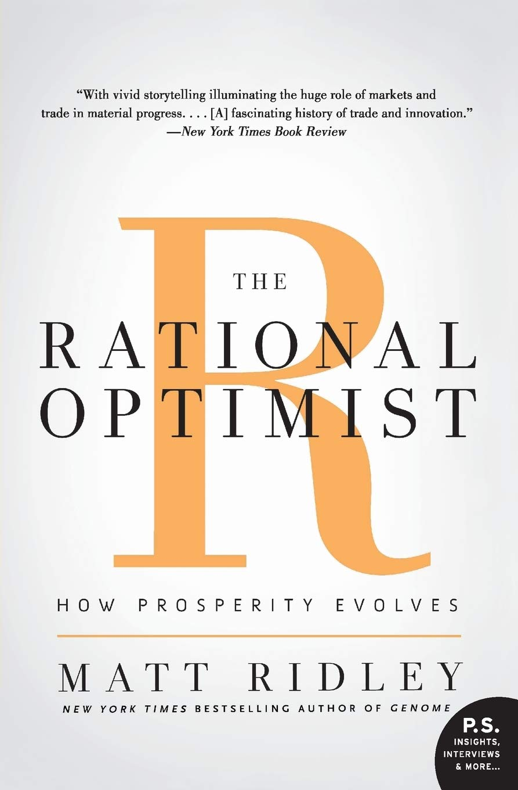
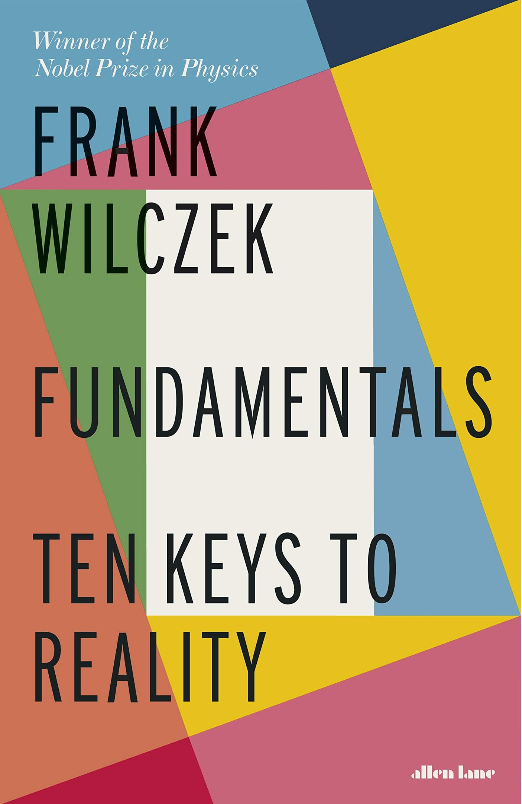
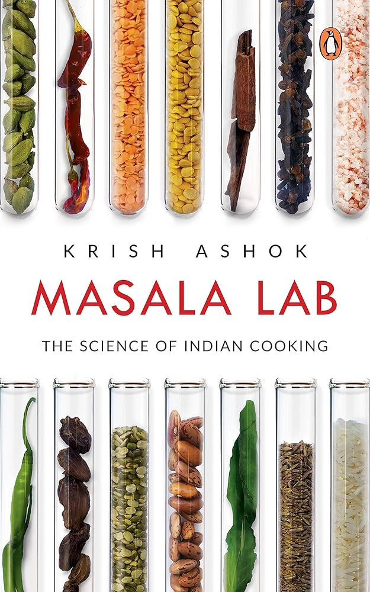
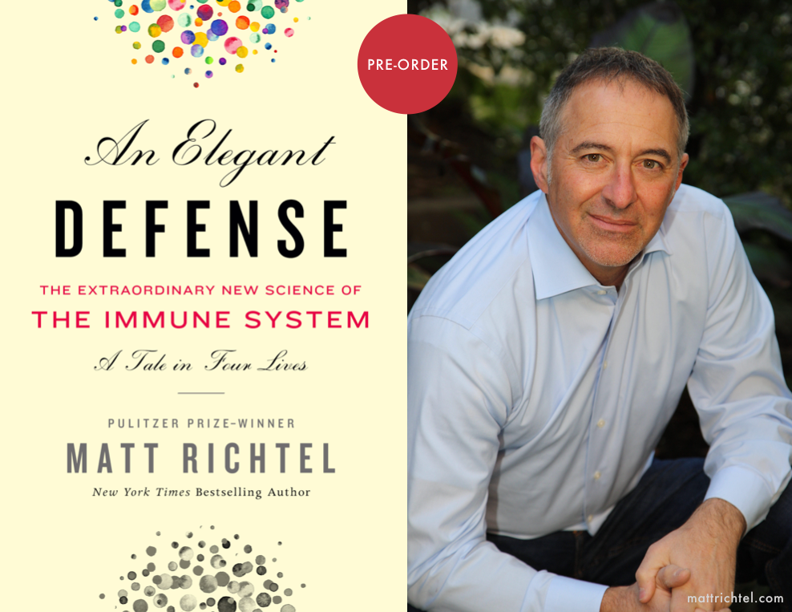
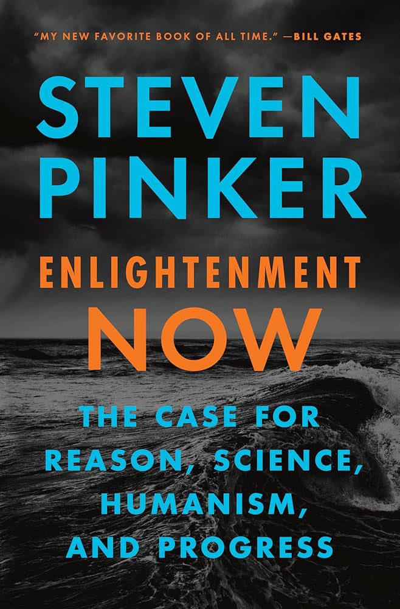
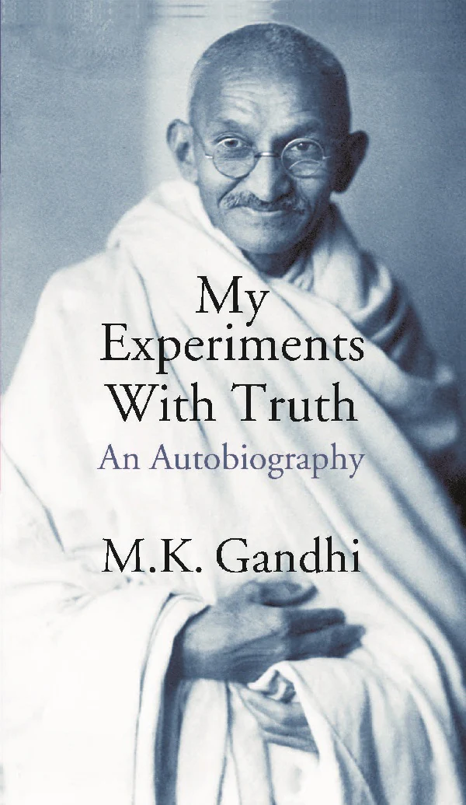
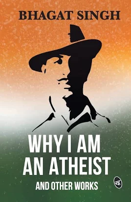
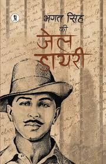
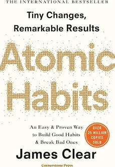
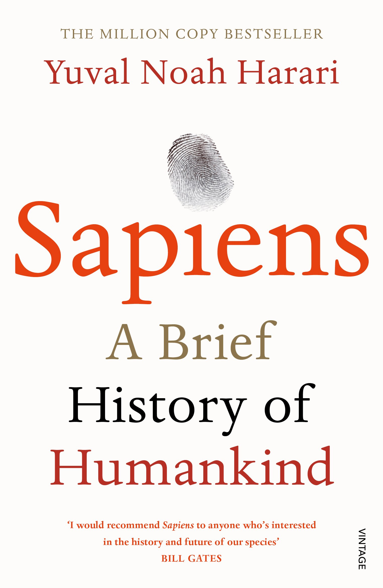

# Books to read

## 1. Rational optimist (by Matt Ridley)

## 2. Fundamentals ten keys to reality (by Frank Wilczek)

## 3. Masala lab (by Krish Ashok) 

## 4. An elegant defence (by Matt Richtel)

## 5. Enlightenment Now (by Steven Pinker)

## 6. The Story of My Experiments with Truth (by Mahatma Gandhi)

## 7. Why i am an athiest and other work (by bhagat singh)

## 8. Jail dairy (by bhagat singh)

## 9. Atomic Habits (by James clear)

## 10. Sapiens (by Yuval Noah Harari)

